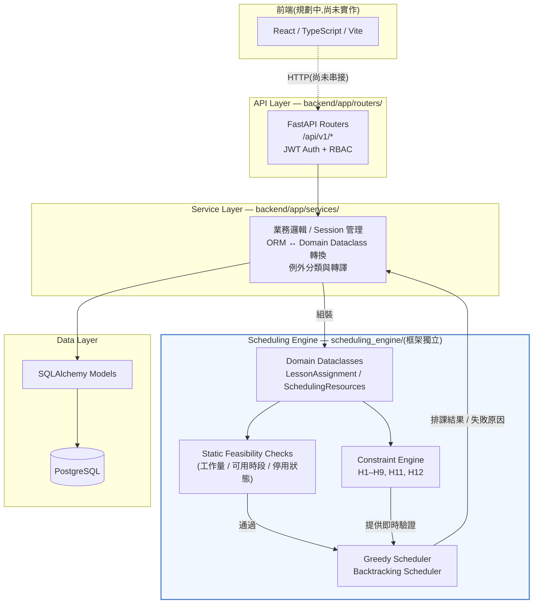

# 系統設計文件:國小智慧排課系統

> 本文件的目的是給面試/作品集講述用,重點在「為什麼這樣設計」,不是重複程式碼或 API 規格(API 規格已經由 FastAPI 自動產生的 `/docs` 涵蓋)。內容全部來自實際程式碼、docstring、以及開發過程中每個 Task 的實作紀錄——不確定的地方會明講「這是我的推論,不是逐字紀錄」,不會編造。

---

## 1. 專案定位

這不是一個 CRUD 練習,而是一個**約束滿足問題(Constraint Satisfaction Problem, CSP)的建模與求解專案**:輸入是老師的任教資格、可用時段、工作量上限、班級的每週授課節數需求、教室類型限制;輸出是一份滿足所有 Hard Constraint 的課表,或者——當滿足不了的時候——一份「講得出具體原因」的失敗報告。CRUD、Auth、REST API 只是把這個求解引擎包裝成一個可操作的系統所需要的基礎設施,真正的核心是 `scheduling_engine/` 這個完全獨立的約束引擎與排課演算法。

---

## 2. 整體架構



**為什麼 Scheduling Engine 要獨立於框架**:`scheduling_engine/` 底下沒有任何一行 import SQLAlchemy、FastAPI,或是直接碰資料庫——它只吃/吐純 Python dataclass(`LessonAssignment`、`SchedulingResources`、`ConstraintViolation`…)。這不是為了「看起來架構乾淨」而做的形式主義,而是有具體、可驗證的好處:

- **測試速度**:`tests/scheduling_engine/` 底下總共 64 個測試(Constraint、Greedy、Backtracking、靜態可行性檢查),全部在 2 秒內跑完,因為完全不需要 `Base.metadata.create_all()`/`drop_all()` 這種資料庫層級的操作。相對地,`tests/` 底下 180 個 API 層測試,因為每個測試都要對真實 PostgreSQL 建表/清表,總耗時要 25 秒以上。
- **獨立可測試性**:Task 17 到 Task 23 開發整個約束引擎、Greedy、Backtracking、靜態可行性檢查的過程中,一次都沒有啟動過 FastAPI 或連過資料庫——所有邏輯都是用手寫的 dataclass 資料直接驗證。直到 Task 21 才第一次需要「接上真實資料庫」,而那個轉接層(`backend/app/services/scheduler.py`)清楚地被隔離在 Service 層,`scheduling_engine/` 本身完全沒被碰過。
- **關注點分離**:排課邏輯的正確性(這組候選會不會衝突、這樣排合不合法)跟「這筆資料在資料庫裡長怎樣」是兩個完全不同層次的問題,混在一起會讓兩邊都難測試、難改。

---

## 3. Domain Model

```mermaid
erDiagram
    ACADEMIC_YEAR ||--o{ SEMESTER : "有"
    SEMESTER ||--o{ CLASS_SUBJECT_REQUIREMENT : "有"
    SEMESTER ||--o{ SCHEDULE_VERSION : "有"
    GRADE ||--o{ CLASS : "有"
    ROOM |o--o{ CLASS : "擔任導師班教室(選填)"
    CLASS ||--o{ CLASS_SUBJECT_REQUIREMENT : "有"
    SUBJECT ||--o{ CLASS_SUBJECT_REQUIREMENT : "有"
    TEACHER |o--o{ CLASS_SUBJECT_REQUIREMENT : "指定教師(選填)"
    TEACHER ||--o{ TEACHER_SUBJECT : "任教資格"
    SUBJECT ||--o{ TEACHER_SUBJECT : "被授資格"
    TEACHER ||--o{ TEACHER_AVAILABILITY : "不可用時段"
    TIME_SLOT ||--o{ TEACHER_AVAILABILITY : "被標記不可用"
    CLASS_SUBJECT_REQUIREMENT ||--o{ LESSON : "產生(diff-sync)"
    LESSON ||--o{ SCHEDULE : "在某版本中被排入"
    SCHEDULE_VERSION ||--o{ SCHEDULE : "包含"
    TEACHER |o--o{ SCHEDULE : "被指派(選填)"
    TIME_SLOT |o--o{ SCHEDULE : "被指派(選填)"
    ROOM |o--o{ SCHEDULE : "被指派(選填)"

    SCHOOL {
        int id PK
        string name
        bool is_active
    }
    USER {
        int id PK
        string username UK
        string hashed_password
        string role "ADMIN or TEACHER"
    }
    CLASS_SUBJECT_REQUIREMENT {
        int id PK
        int semester_id FK
        int class_id FK
        int subject_id FK
        int weekly_periods
        int required_teacher_id FK "nullable"
        string required_room_type "nullable"
        int consecutive_limit "nullable, 尚未使用"
    }
    LESSON {
        int id PK
        int class_subject_requirement_id FK
        int sequence_number
    }
    SCHEDULE_VERSION {
        int id PK
        int semester_id FK
        int version_number
        string status "DRAFT or PUBLISHED"
    }
    SCHEDULE {
        int id PK
        int schedule_version_id FK
        int lesson_id FK
        int teacher_id FK "nullable"
        int time_slot_id FK "nullable"
        int room_id FK "nullable"
    }
    TEACHER {
        int id PK
        string name
        bool is_active
        int min_weekly_periods "尚未有對應 constraint"
        int max_weekly_periods
    }
```

> 圖中刻意把 `SCHOOL` 跟 `USER` 畫成沒有任何關聯線——這是如實反映現況,不是畫錯。細節見第 8 節「已知限制」。

### 3.1 四個非直覺但刻意的設計決策

**(1) `TeacherAvailability`:用「存在即不可用」取代 `is_available: bool` 欄位**
`TeacherAvailability` 表只記錄「這位老師在這個時段不可用」的例外情況,沒有欄位存「可用」——一個老師沒有出現在這張表裡,就代表所有時段都可用。這是刻意的精簡設計:現實中「不可用時段」通常是少數例外(某老師週三下午要開會),把「可用」當預設值、只記錄例外,資料量遠比「每個老師 × 每個時段都存一筆 True/False」小得多,查詢邏輯也更貼近業務語意(「這個時段有沒有被排除」而不是「查出所有 True 的列」)。`RequiredTeacherRule`、`RoomTypeRequirement` 也採用同一種「稀疏表示,沒有規則=無限制」的模式。

**(2) `Lesson` / `Schedule` / `ScheduleVersion` 三層分離**
這三張表分別回答三個不同的問題:`ClassSubjectRequirement` 說「這個班這學期這科目需要幾節課」;`Lesson` 是把「幾節課」具體展開成的一份**版本無關**的待排清單(3 節課 = 3 筆 `Lesson`,不管排到哪個版本);`Schedule` 才是「某個 `Lesson` 在某個特定 `ScheduleVersion` 裡實際落在哪個時段/老師/教室」。這樣分層之後,重新排一次課(建立新的 `ScheduleVersion`)不需要重新產生 `Lesson`,同一批 `Lesson` 可以在多個版本裡有不同的排法——這正是「Draft / Published 版本管理」得以成立的資料結構基礎。

**(3) 中介表沒有獨立的 CRUD endpoint,而是語意化巢狀在資源底下**
`TeacherSubject`(任教資格)、`TeacherAvailability`(不可用時段)不是 `/api/v1/teacher-subjects`、`/api/v1/teacher-availabilities` 這種獨立資源,而是 `POST/GET/DELETE /api/v1/teachers/{id}/subjects`、`/api/v1/teachers/{id}/unavailable-slots`。理由是這兩張表脫離「某位老師」的脈絡沒有獨立存在的意義——沒有人會想單獨查「所有教師資格紀錄」而不關心是哪位老師,把它們設計成子資源讓 API 的形狀直接對應到業務語意,也讓 404(教師不存在)自然發生在對的層級。

**(4) `ActiveStatusInfo` 用一個共用 dataclass 取代四個各自獨立的 Active 狀態類別**
H12(停用狀態)理論上要分別檢查教師/班級/科目/教室四種實體是否停用,直覺的做法是寫 `TeacherActiveStatus`、`ClassActiveStatus`…四個結構幾乎一樣的 dataclass。但這四者的「形狀」完全相同(一個 id + 一個布林值),差別只在 id 取自哪個實體的 id 空間,所以最終設計成一個帶 `entity_type: Literal["teacher","class","subject","room"]` 判別欄位的共用 dataclass。這避免了四份幾乎重複、卻仍然需要一樣的 Constraint 處理邏輯的程式碼。

---

## 4. 排課演算法

### 4.1 MRV → Greedy → Backtracking 的分工

三者不是三個互相替代的方案,而是一條漸進的責任鏈:

1. **MRV(Most Restrictive Variable First)排序**:兩個演算法共用同一套排序邏輯(`algorithms/resources.py::candidate_teacher_ids`)——先處理候選老師最少的 `Lesson`。有 `required_teacher_id` 的 `Lesson` 天生只有 1 個候選,永遠排最前面。這個排序只計算一次,搜尋過程中永遠不重新排序(重新排序的是「搜尋順序」的假設會被打破,不利於 Backtracking 的正確性推理)。
2. **Greedy Scheduler**:依照 MRV 順序,對每個 `Lesson` 選第一個通過即時 Hard Constraint 檢查的候選,選完就不再回頭。優點是快、實作簡單;缺點是一旦某個選擇卡死後面的 `Lesson`,整次排課就直接宣告失敗,即使換一個更早的選擇就能成功。
3. **Backtracking Scheduler**:候選產生邏輯與 Greedy 完全共用(同一個 `resources.py`),差別只在「某個 `Lesson` 沒有候選可用時該怎麼辦」——Greedy 直接放棄,Backtracking 會**撤回前一個 `Lesson` 的選擇**,換下一個候選再試一次。這是用游標(`cursor[i]`)記錄每個位置下一個要試的候選索引,回溯時游標不歸零(只有「第一次前進到這個位置」才歸零),確保搜尋不會重複做過的嘗試。

測試中有一個具體案例直接證明兩者的差異:`test_backtracking_succeeds_where_greedy_fails`——同一組輸入,Greedy 因為貪心搶走了唯一一間特殊教室而失敗,Backtracking 靠撤回重試成功排出結果。

### 4.2 H1–H12 實作狀態

| # | 名稱 | 狀態 | 說明 |
|---|------|------|------|
| H1 | Teacher Conflict | ✅ 已做 | 即時檢查,兩演算法皆有 |
| H2 | Class Conflict | ✅ 已做 | 即時檢查 |
| H3 | Room Conflict | ✅ 已做 | 即時檢查 |
| H4 | Teacher Availability | ✅ 已做 | 即時檢查 |
| H5 | Teacher Qualification | ✅ 已做 | 即時檢查;與 H6 交互時的邊界案例見第 6 節「相關」討論(Task 22 bug) |
| H6 | Required Teacher | ✅ 已做 | 同時影響候選產生(MRV 篩到只剩 1 個)與即時驗證(雙重保險) |
| H7 | Weekly Subject Requirement | ✅ 已做,**僅整批驗證** | 數學上無法逐候選檢查,見 4.3 |
| H8 | Teacher Maximum Workload | ✅ 已做,**Greedy 整批 / Backtracking 即時** | 兩演算法刻意採不同策略,見 4.3 |
| H9 | Room Type | ✅ 已做 | 即時檢查;查無資料時的處理原則見第 6 節 |
| H10 | Room Capacity | ⏸️ **延後** | `Room.capacity` 欄位已預留(nullable),但未實作對應 Constraint,見第 8 節 |
| H11 | Non-teaching Period | ✅ 已做 | 即時檢查 |
| H12 | Active Status | ✅ 已做 | 即時檢查,涵蓋教師/班級/科目/教室 |

12 條 Hard Constraint 中 11 條已實作(H1–H9、H11、H12),H10 是唯一延後項目。

### 4.3 H7 與 H8:為什麼一個永遠整批驗證、一個可以即時過濾

H7(「這個需求恰好要有 N 節課」)是一個**等式**限制:排課過程中任何時間點,已排入的節數必定 ≤ 目標值,這跟「真的會短缺」在數學上無法區分,只有排入最後一節課的當下才知道對不對。所以 H7 在兩個演算法裡都只能是排完之後的整批檢查,不存在「提早篩掉候選」的可能。

H8(「這位老師每週不能超過上限」)是一個**上限**限制:一旦某個候選會讓老師超過上限,這個事實不會因為後面又排了別的東西而改變,可以安全地在候選產生階段就篩掉。但兩個演算法對這件事的態度不一樣——**Greedy 選擇不做即時 H8 過濾**,因為 Greedy 沒有回頭機制,提早篩掉候選只會讓失敗發生在更早的 `Lesson`,不會改變「這次排課到底成不成功」的結果,所以不值得為此增加複雜度;**Backtracking 選擇即時過濾**,因為 Backtracking 可以靠撤回重試來利用這個提早發現的資訊,避免整個搜尋走進一個從一開始就注定失敗的分支,能有效減少不必要的回溯次數。

---

## 5. Explainable Scheduling

系統的一個核心原則(來自 `AGENTS.md` 第 8 節)是:排課失敗不能只回一句「排不出來」,必須講出「為什麼」跟「可能怎麼解決」。

### 5.1 `ConstraintViolation`:所有失敗訊息的共同格式

每一種違規都用同一個 dataclass 表達:`type`、`severity`、`lesson_id`、`teacher_id`、`class_id`、`subject_id`、`time_slot_id`、`message`、`suggested_action`,加上後來因應實際需求陸續補上的 `room_id`(Task 17.5)與 `class_subject_requirement_id`(Task 19)。這個欄位集合不是一開始就設計完整,而是隨著實際寫測試、發現「這種違規講不清楚是哪個班的哪個需求」的過程中逐步補齊——這也是為什麼優先順序把「正確性」跟「可理解性」放在「功能完整」前面:先讓已實作的部分講得清楚,比一開始就設計一個大而全的結構更重要。

### 5.2 三種搜尋層級的失敗類型

Backtracking 的結果區分三種本質不同的失敗:

- **`DEFINITELY_INFEASIBLE`**:搜尋空間被完整耗盡(或某個 `Lesson` 一開始就零候選),這是一個確定的答案——不是「目前找不到」,而是「保證不存在」。
- **`SEARCH_LIMIT_EXCEEDED`**:在 `max_backtrack_steps` 次回溯內沒找到解,但不代表無解,只代表搜尋預算不夠。
- **`TIMEOUT`**:同樣不代表無解,只是時間到了。

這個區分很重要:對使用者來說,「保證排不出來,問題出在資料本身」跟「可能排得出來,但機器沒找到,試著放寬搜尋預算」是完全不同的建議。

### 5.3 靜態可行性檢查(Task 23):不用搜尋就能證明無解

有三類問題根本不需要跑一次搜尋就能靠加總/比對確定會失敗:

1. **教師工作量超標**:被 `required_teacher_id` 指定的所有 `Lesson` 節數加總,超過該教師 `max_weekly_periods`。
2. **教師可用時段不足**:被指定的節數超過該教師實際可用的時段數(全校時段數 − 該教師不可用時段數)。
3. **停用狀態衝突**:需求涉及的教師/班級/科目本身就是停用狀態。

這三類檢查在 `run-scheduler` 呼叫 `schedule_backtracking()` 之前執行,一旦命中就直接回報,完全不進入搜尋——這不只是「跑得快」,更重要的是這類失敗如果讓 Backtracking 自己去發現,很可能落在「搜尋整個耗盡、但無法歸咎到單一 `Lesson`」的模糊地帶(這正是 Task 22 修的那個 bug 的根源:一個必然失敗的案例,因為候選產生邏輯沒有正確識別它是「零候選」,結果搜尋跑到底才回報「無解」卻給不出任何理由)。

### 5.4 具體案例:教師工作量超標的完整錯誤訊息

假設老師 6 被兩個需求(id=1、id=2)都指定為 `required_teacher_id`,兩者加起來需要 6 節課,但這位老師的 `max_weekly_periods` 只有 5。呼叫 `POST /api/v1/schedule-versions/{id}/run-scheduler` 會得到:

```json
HTTP 422

{
  "failure_type": "STATIC_CHECK_FAILED",
  "lesson_failures": [],
  "post_hoc_violations": [
    {
      "type": "STATIC_TEACHER_WORKLOAD_EXCEEDED",
      "severity": "ERROR",
      "lesson_id": null,
      "teacher_id": 6,
      "class_id": null,
      "subject_id": null,
      "time_slot_id": null,
      "room_id": null,
      "class_subject_requirement_id": null,
      "message": "Teacher 6 is required (via required_teacher_id) for 6 lessons this run -- across requirement(s) [1, 2] -- but their max_weekly_periods is only 5.",
      "suggested_action": "Raise teacher 6's max_weekly_periods, reduce weekly_periods on the affected requirement(s), or reassign the required-teacher rule on some of them."
    }
  ],
  "backtrack_count": 0
}
```

`backtrack_count: 0` 不是巧合,而是結構性保證——`schedule_backtracking()` 這一行程式碼在原始碼裡位於這個提早回傳之後,根本不會被執行到。

---

## 6. 關鍵架構決策紀錄

| # | 問題 | 選項 | 決定 | 理由 |
|---|------|------|------|------|
| 1 | `generate-lessons`(diff-sync)遇到「現有 Lesson 數量已超過 weekly_periods」該怎麼辦?排課失敗時,已經嘗試過的部分結果該不該寫入? | (a) 自動刪除多餘資料 / 寫入部分結果 (b) 整批中止,完全不寫入,回報清單 | (b) | `Lesson`/`Schedule` 底下可能已經有後續資料(已排課結果、人工調整),自動刪除或寫入部分結果等於默默丟棄或誤導使用者。`AGENTS.md` 明文禁止「把部分排好的課表當作成功結果」,採 all-or-nothing 讓呼叫端得到一個可預期、可驗證的結果,而不是一個「半成功」的模糊狀態。 |
| 2 | `Teacher.qualified_subjects` / `unavailable_slots` 這類多對多關聯,要不要開放透過 relationship 直接 `.append()` 寫入? | (a) 可寫入的 relationship (b) `viewonly=True`,強制透過 `TeacherSubject`/`TeacherAvailability` 物件本身建立 | (b) | 這兩張中介表本身帶有業務語意(資格、不可用時段紀錄),不是純粹的多對多橋接表。強制透過物件寫入,確保「讀」跟「寫」走同一條、可測試的路徑,也避免關聯的隱式 INSERT 繞過未來可能加上的欄位驗證。 |
| 3 | 已發布(PUBLISHED)版本要不要能被修改? | (a) 允許管理員強制覆蓋 (b) 完全鎖定,包括不能改回 DRAFT,唯一出路是複製一份新 Draft | (b) | 規格明確要求「Published 不可直接修改」。若開放「改回 DRAFT」這個例外,等於留了一個繞過鎖定的後門——選擇行為最單純、最容易對使用者解釋的版本(「發布了就是發布了,要改就開新草稿」),複製機制列為下一步待辦。 |
| 4 | H9(教室類型)檢查時,如果查無對應的 `RoomInfo`/`TimeSlotInfo` 資料,該視為違規還是放行? | (a) 保守起見視為違規 (b) 視為「資料不足、無法判斷」,不算違規 | (b),並讓 H9 與已有的 H11 保持一致 | Hard Constraint 的職責是「證明違規」,不是「證明合法」。查無資料代表輸入資料本身不完整,那是上游資料品質的問題,不應該由 Constraint 用猜測的方式懲罰一個它其實無法判斷的案例。這是 Task 18.5 從一個實際不一致(H9 跟 H11 處理方式不同)修正而來的原則。 |
| 5 | 為什麼不直接用 OR-Tools(或其他現成的 CP-SAT/排課求解器)? | (a) 直接呼叫成熟求解器套件 (b) 自己實作 Constraint Engine + Greedy + Backtracking | (b) | *(這一項是我依專案定位推論出的理由,不是逐字對話紀錄——建議你確認或用自己的話補充)* 這是一個學習與作品集專案,核心價值在於展示「如何為一個真實問題建立 CSP 模型、設計約束、實作可解釋的求解演算法」的能力。直接呼叫 OR-Tools 會把最有學習/展示價值的部分外包掉,也不利於面試時講清楚「為什麼這樣設計」;引入這樣一個大型 dependency 也不符合 `AGENTS.md`「新增 dependency 前要說明理由並經確認」的原則。 |
| 6 | H7(精確節數)、H8(工作量上限)這類「加總型」限制,能不能像 H1–H6 一樣逐候選即時過濾? | (a) 全部整批驗證 (b) 依「上限型」與「精確型」分別處理 | (b):H7 永遠整批(數學上不可能提早判定);H8 在 Backtracking 即時檢查,Greedy 仍整批 | 見第 4.3 節的完整推導——上限型限制滿足後不會因後續動作失效,可安全提早篩選;精確型限制在過程中恆為「未達標」,無法與真正短缺區分。Greedy 沒有回頭機制,提早篩選不影響最終成敗,不值得做;Backtracking 可以靠回溯利用這個資訊避免走進死路分支。 |
| 7 | `scheduling_engine/` 在 repo 根目錄,是 `backend/` 的手足目錄(不是子套件),`backend/app/services/scheduler.py` 要怎麼 import 它? | (a) 把 `scheduling_engine/` 搬進 `backend/app/` 底下 (b) 在轉接層檔案加一段 `sys.path` bootstrap | (b) | 搬動目錄會讓 `scheduling_engine/` 看起來像是 backend 的子模組,模糊了它「框架獨立、原則上可以獨立安裝/發布」的定位。專案裡已經有兩個方向相反、但問題本質相同的先例(`backend/alembic/env.py`、`tests/conftest.py`),延續同一套解法比改動目錄結構的架構代價更小。 |
| 8 | 對一個已經有 `Schedule` 記錄的版本重新呼叫 `run-scheduler`,該怎麼處理? | (a) 自動覆蓋既有結果 (b) 拒絕(409),要求先手動刪除既有記錄 | (b) | 與決策 1 同樣的「不自動覆蓋/丟棄資料」精神——已存在的 `Schedule` 可能是已發布的正式課表,或人工微調過的結果,自動覆蓋的風險遠高於多一步手動確認的成本。 |

---

## 7. 測試策略

測試分成兩個完全獨立的層級,理由直接對應第 2 節提到的架構分離:

- **`tests/scheduling_engine/`(64 個測試)**:純 Python 邏輯測試,輸入輸出都是手寫的 dataclass,不碰資料庫、不啟動 FastAPI。這一層測試的是「約束有沒有正確判斷違規」「MRV 排序對不對」「回溯的邊界語意精不精確」這些領域邏輯的正確性,可以用最小、最精確的手造資料涵蓋邊界案例(例如刻意讓 Greedy 失敗、Backtracking 成功的對照組)。
- **`tests/`(180 個測試)**:透過 `TestClient` 打真實的 FastAPI + PostgreSQL(獨立的 `timetable_test` 資料庫,每個測試前後 `create_all`/`drop_all`),測試的是「這一層有沒有正確接起來」——路由、認證/授權、Pydantic 驗證、資料庫約束、例外轉譯成正確的 HTTP 狀態碼。

兩層分開測試,不是為了湊測試數量,而是因為它們回答的問題完全不同:引擎層測試不應該因為資料庫連線設定錯誤而失敗,API 層測試也不需要重新驗證約束邏輯本身對不對(那是引擎層的責任)。

**目前總計 244 個測試**,分佈:

| 類別 | 測試數 |
|---|---|
| Scheduling Engine(純邏輯) | 64 |
| ├─ Constraint 單元測試 | 37 |
| ├─ Backtracking | 10 |
| ├─ 靜態可行性檢查 | 10 |
| └─ Greedy | 7 |
| API / 整合測試 | 180 |
| ├─ ScheduleVersion(含 PUBLISHED 鎖定) | 20 |
| ├─ Schedule(含 PUBLISHED 鎖定) | 17 |
| ├─ Class | 13 |
| ├─ ClassSubjectRequirement | 12 |
| ├─ Semester / TimeSlot | 11 / 11 |
| ├─ AcademicYear / Room / Subject / Teacher | 各 10 |
| ├─ Scheduler(排課 API 端到端) | 10 |
| ├─ Auth / Grade / School | 各 9 |
| ├─ TeacherAvailability / TeacherSubject | 各 8 |
| └─ Lesson | 3 |

---

## 8. 已知限制與未來規劃

以下項目都是**有意識排定優先順序後暫緩**,不是遺漏——`AGENTS.md` 本身就把它們排在目前開發階段之後(見其第 26 節的優先順序清單):

- **H10 Room Capacity 未實作**:`Room.capacity` 欄位已經預留(nullable,方便未來不需要改 schema 就能加上這條 Constraint),但 Constraint 本身在 Task 17–20 系列被明確排除在範圍外。
- **Soft Constraints(S1–S7)完全未開始**:例如教師每日負擔平衡、避免連續過多堂課等。`AGENTS.md` 明訂「先滿足所有 Hard Constraint,再比較 Soft Constraint 分數」,目前連 Hard Constraint 都才剛補齊靜態可行性檢查,Soft Constraint 排在後面。
- **版本複製機制未實作**:Published 版本的鎖定機制(Task 25)本身完整,但「從 Published 複製一份新 Draft 出來修改」這個配套動作還沒做——目前一個版本被發布後,理論上沒有任何合法路徑可以再產生它的修改版。
- **手動調整課表沒有重新驗證**:`AGENTS.md` 第 15 節要求手動調整課表時後端仍要重新驗證 Hard Constraint,但目前 `PATCH /schedules/{id}` 只檢查了型別、外鍵存在性、與 PUBLISHED 鎖定,沒有跑任何一條 H1–H12 檢查——也就是說目前可以透過手動 PATCH 把兩堂課排到同一個老師的同一個時段。
- **前端完全未開始**:React/TypeScript/Vite 專案骨架都還沒建立,`README.md` 也仍停留在初始狀態。
- **`TeacherClassAssignment` 未實作**:`AGENTS.md` 原始 domain 設計把「資格」(`TeacherSubject`)跟「這學期實際負責哪個班」(`TeacherClassAssignment`)分成兩張表,但目前系統排課時直接把「所有具備資格的老師」當候選池,沒有校方預先指派這一層篩選。
- **`User` 帳號與 `Teacher` 網域實體沒有關聯**:登入系統的 `User`(`ADMIN`/`TEACHER` 角色)跟排課領域裡的 `Teacher` 是兩張完全獨立的表,一個 `TEACHER` 角色的帳號目前無法對應到某一位特定 `Teacher`,「老師只能看到自己的課表」這類功能還做不到。
- **`STUDENT` 角色未實作**:`AGENTS.md` 列出三種角色,目前 `User.role` 的 CheckConstraint 只接受 `ADMIN`/`TEACHER`。
- **`School` 沒有實際接進資料模型**:`School` 表存在,但沒有任何其他表的外鍵指向它——系統實質上是隱含的單一學校假設,`Grade.level` 全域唯一就是這個假設的直接後果(如果要支援多校,這條唯一約束必須改成 `(school_id, level)` 複合唯一)。
- **`Teacher.min_weekly_periods` 與 `ClassSubjectRequirement.consecutive_limit` 是「已建欄位、未接引擎」的狀態**:前者沒有對應的「最低工作量」Hard Constraint(目前只有 H8 上限),後者對應到 Soft Constraint S4(避免連續過多堂課),尚未實作。

---

## 9. 電梯簡報草稿(30 秒版本)

> 這是一個國小排課系統,重點不是 CRUD,而是把老師的任教資格、可用時段、工作量上限,還有班級的每週需求、教室類型,建成一套完全獨立於 API 框架跟資料庫的 Constraint Engine,自己實作了 Greedy 跟 Backtracking 兩種排課演算法。系統的重點之一是「可解釋」——每次排不出課表,都能講出具體是哪個老師、哪個限制造成的,而不是只回一句排不出來。目前有 244 個自動化測試,排課引擎那部分完全不需要資料庫,秒級就能跑完。

（可依實際口語習慣調整用詞與停頓,上面這版大約落在 30 秒中等語速。）
