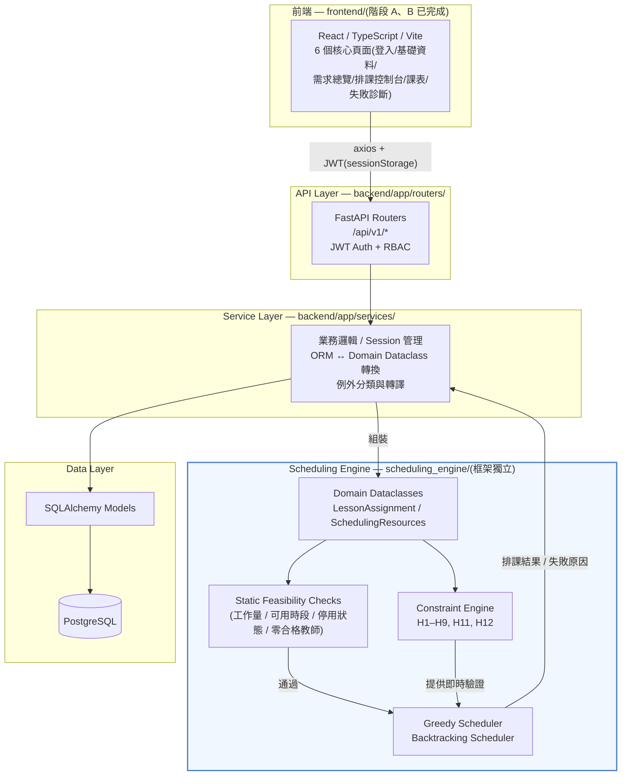

# 系統設計文件:國小智慧排課系統

> 本文件給面試/作品集講述用,說明「為什麼這樣設計」。API 規格已經由 FastAPI 自動產生的 `/docs` 涵蓋,這裡不重複。內容來自實際程式碼、docstring,以及開發過程中每個 Task 的實作紀錄;不確定的地方會註明「這是我的推論,不是逐字紀錄」。

---

## 1. 專案定位

這是一個**約束滿足問題(Constraint Satisfaction Problem, CSP)的建模與求解專案**:輸入是老師的任教資格、可用時段、工作量上限、班級的每週授課節數需求、教室類型限制;輸出是一份滿足所有 Hard Constraint 的課表,或者——當滿足不了的時候——一份講得出具體原因的失敗報告。CRUD、Auth、REST API 是把這個求解引擎包裝成可操作系統所需要的基礎設施,核心是 `scheduling_engine/` 這個完全獨立的約束引擎與排課演算法。

---

## 2. 整體架構


```mermaid
flowchart TB
    subgraph Client["前端 — frontend/(階段 A、B 已完成)"]
        React["React / TypeScript / Vite<br/>6 個核心頁面(登入/基礎資料/<br/>需求總覽/排課控制台/課表/失敗診斷)"]
    end

    subgraph API["API Layer — backend/app/routers/"]
        FastAPI["FastAPI Routers<br/>/api/v1/*<br/>JWT Auth + RBAC"]
    end

    subgraph Service["Service Layer — backend/app/services/"]
        SVC["業務邏輯 / Session 管理<br/>ORM ↔ Domain Dataclass 轉換<br/>例外分類與轉譯"]
    end

    subgraph Engine["Scheduling Engine — scheduling_engine/(框架獨立)"]
        Domain["Domain Dataclasses<br/>LessonAssignment / SchedulingResources"]
        Static["Static Feasibility Checks<br/>(工作量 / 可用時段 / 停用狀態 / 零合格教師)"]
        Constraints["Constraint Engine<br/>H1–H9, H11, H12"]
        Algo["Greedy Scheduler<br/>Backtracking Scheduler"]
    end

    subgraph Data["Data Layer"]
        ORM["SQLAlchemy Models"]
        PG[("PostgreSQL")]
    end

    React -->|"axios + JWT(sessionStorage)"| FastAPI
    FastAPI --> SVC
    SVC -->|"組裝"| Domain
    Domain --> Static
    Static -->|"通過"| Algo
    Domain --> Constraints
    Constraints -->|"提供即時驗證"| Algo
    Algo -->|"排課結果 / 失敗原因"| SVC
    SVC --> ORM
    ORM --> PG

    style Engine fill:#f0f7ff,stroke:#4a7fc9,stroke-width:2px
```

**為什麼 Scheduling Engine 要獨立於框架**:`scheduling_engine/` 底下沒有任何一行 import SQLAlchemy、FastAPI,或是直接碰資料庫,只吃/吐純 Python dataclass(`LessonAssignment`、`SchedulingResources`、`ConstraintViolation`…)。這個邊界帶來幾個具體、可驗證的好處:

- **測試速度**:`tests/scheduling_engine/` 底下總共 73 個測試(Constraint、Greedy、Backtracking、靜態可行性檢查、Fixed Time Slot),實測 `pytest tests/scheduling_engine/ -q` 只要 **0.12 秒**,因為完全不需要 `Base.metadata.create_all()`/`drop_all()` 這種資料庫層級的操作。相對地,`tests/` 底下 278 個 API 層測試,因為每個測試都要對真實 PostgreSQL 建表/清表,總耗時約 94 秒。
- **獨立可測試性**:Task 17 到 Task 23 開發整個約束引擎、Greedy、Backtracking、靜態可行性檢查的過程中,一次都沒有啟動過 FastAPI 或連過資料庫——所有邏輯都是用手寫的 dataclass 資料直接驗證。直到 Task 21 才第一次需要「接上真實資料庫」,而那個轉接層(`backend/app/services/scheduler.py`)清楚地被隔離在 Service 層,`scheduling_engine/` 本身完全沒被碰過。
- **關注點分離**:排課邏輯的正確性(這組候選會不會衝突、這樣排合不合法)跟「這筆資料在資料庫裡長怎樣」是兩個完全不同層次的問題,混在一起會讓兩邊都難測試、難改。

---

## 3. 前端架構

第一版本文件(Task 26)寫成時,系統完全沒有前端,只能透過 Swagger UI 操作——這種呈現方式沒辦法讓非技術背景的人(或只有幾分鐘評估時間的面試官)在短時間內感受到 Scheduling Engine 背後的設計價值。`docs/FRONTEND_REQUIREMENTS.md` 明確把前端存在的目的定義為「**降低理解門檻,不是做一套完整的教務系統**」,並訂出一條貫穿所有頁面取捨的判斷標準:「這個畫面能不能讓看的人在 10 秒內感受到『這是一個會思考的排課系統,不是一個表單工具』?不能的,不做。」

這個定位決定了採**分階段策略**:

- **階段 A(已完成)**:本節描述的 6 個核心頁面,唯讀為主,聚焦展示排課引擎的核心能力。
- **階段 B(已完成)**:9 張基礎資料表與排課需求的新增/編輯/刪除表單、老師的任教資格與不可用時段管理、依角色區分的畫面權限,以及統一的 Tailwind 設計系統,見 3.4–3.6。使用者/角色管理介面不在階段 B 的範圍內,之後由 Task 59 補上帳號管理頁(見 3.2),剩餘限制列在第 10 節。

階段 A 開發時刻意保留了往階段 B 擴充的空間,而不是先把架構寫死成純唯讀再回頭重寫——`docs/FRONTEND_REQUIREMENTS.md` 第 4 章把這點列為硬性約束而非建議:API 呼叫層一開始就完整定義 `list`/`get`/`create`/`update`/`remove` 五種操作的簽章(階段 A 只是「先不呼叫」後三種,不是「介面裡沒有」)、清單頁的表格版面預留操作按鈕欄位、TypeScript 型別對齊後端 Pydantic Schema 的全部欄位而非只挑顯示會用到的子集。

### 3.1 技術選型

| 項目 | 決定 | 理由 |
|---|---|---|
| 前端框架 | React + TypeScript + Vite | 沿用專案最初規格書既定選型 |
| 路由 | React Router | 頁面數量少,業界標準,學習成本低 |
| 狀態管理 | React 內建 `useState`/`useContext` | 頁面少、資料流簡單,不需要 Redux/Zustand 這類額外套件增加複雜度 |
| HTTP 呼叫 | axios(而非原生 `fetch`) | 每個請求都要帶 JWT token、且需統一處理排課失敗時的結構化錯誤(`lesson_failures`/`post_hoc_violations`),axios 的攔截器(interceptor)可以統一處理「自動帶 token」與「錯誤格式轉換」,讓開發精力留給課表呈現、失敗診斷這些核心功能 |
| Token 儲存 | `sessionStorage` | 分頁關閉即清除,比 `localStorage` 稍微安全,demo 情境已足夠 |

完整的選型理由、階段 A 的三項擴充性硬性約束、以及失敗診斷畫面的 id/類型轉換機制規格,見 `docs/FRONTEND_REQUIREMENTS.md` 第 4 章。

### 3.2 六個核心頁面

| 頁面 | 路由 | 定位 |
|---|---|---|
| 登入 | `/login` | JWT 認證,取得 token,存入 `sessionStorage` |
| 基礎資料瀏覽 | `/data` | 學校/學年度/學期/年級/老師/班級/科目/教室/時段九類資料的分頁籤(單頁 + 分頁籤切換,不做成獨立路由);階段 A 為唯讀瀏覽,階段 B 起每個分頁皆可新增/編輯/刪除,老師列可展開管理任教資格與不可用時段 |
| 排課需求總覽 | `/requirements` | 顯示目前學期設定的 `ClassSubjectRequirement`,id 轉名稱呈現;階段 B 起可新增/編輯/刪除 |
| 排課控制台 | `/scheduler` | **核心亮點頁面**:選版本 → 展開課程清單 → 觸發自動排課 → 顯示結果;排課失敗時內嵌顯示失敗診斷(見 3.3) |
| 課表檢視 | `/timetable` | **核心亮點頁面**:依班級/教師/教室三種視角查看排課結果,縱軸節次、橫軸星期一到五 |
| 失敗診斷 | 無獨立路由,內嵌於排課控制台 | **核心亮點頁面**:見 3.3 |

（`/` 首頁目前是登入成功後的暫時性佔位頁,尚未實作 `docs/FRONTEND_REQUIREMENTS.md` 流程 A 設想的統計 Dashboard,不計入上述 6 個核心頁面。另有僅 `ADMIN` 可用的「帳號管理」頁(`/users`,Task 59):列出帳號、新增帳號(沿用 `POST /auth/register`)、重設密碼、刪除帳號,屬於系統管理功能,同樣不計入核心頁面。）

「失敗診斷」刻意沒有獨立路由,而是排課失敗時直接嵌入排課控制台畫面——這是實作階段做的決定:失敗診斷永遠緊接在「按下開始排課」這個動作之後,拆成獨立頁面等於多一次導覽、多傳一份跨頁面的 state,對這個一次性、上下文緊密的畫面沒有實質好處。

### 3.3 失敗診斷:整個前端最能對應後端設計理念的一頁

`docs/FRONTEND_REQUIREMENTS.md` 明確把失敗診斷列為「整個前端最有價值的一頁」,理由是它直接把第 6 節 Explainable Scheduling 的設計——`ConstraintViolation` 的共同格式、三種搜尋層級失敗類型、Task 23 的靜態可行性預檢——攤開給非技術背景的人看,呈現「為什麼排不出來、具體是哪個老師哪個限制、建議去哪個畫面修」。

實作上分兩層轉換,都在前端完成,不修改後端或 `scheduling_engine/`(刻意維持後者 framework-independent 的邊界,見第 2 節):

1. **代碼 → 中文說明**:一份 `Record<string, string>` 對照表,涵蓋 5 種頂層 `failure_type`(`DEFINITELY_INFEASIBLE`/`SEARCH_LIMIT_EXCEEDED`/`TIMEOUT`/`REQUIREMENT_PERIODS_MISMATCH`/`STATIC_CHECK_FAILED`)與 16 種 `ConstraintViolation.type`(H1–H9、H11、H12 共 11 條 Hard Constraint,加上 `NO_CANDIDATE_TEACHER`/`H6_REQUIRED_TEACHER_NOT_QUALIFIED` 兩種合成類型,加上 3 種靜態檢查類型)。查不到對照的類型會 fallback 顯示原始英文訊息,不會吞掉或顯示空白。
2. **id → 名稱**:畫面載入時一併查詢教師/班級/科目/教室/時段清單(與基礎資料瀏覽頁共用同一組 API 呼叫,不重複查詢),把 `teacher_id`/`class_id` 這類裸露的資料庫 id 轉換成「楊老師」「五年一班」這樣的實際名稱。

畫面上每則違規固定兩行:違規說明(中文樣板組字,結尾用驚嘆號)、以及「請至 XX 頁面修正」(依違規類型對應到最適合的既有頁面,可點擊連結導向;少數在目前 API 流程中實際不可能觸發、也沒有對應可修正頁面的類型,顯示固定說明文字而非勉強塞一個不準確的連結)。同一個需求底下因完全相同原因失敗的多堂課,會合併成一則訊息(「XX 班的 XX 科目(共 N 堂課):……,這些課無法排定!」)呈現,不逐堂課重複顯示編號無意義的 `lesson_id`。

目前前端沒有建立自動化測試框架(`frontend/package.json` 沒有 `test` 腳本),每個階段 A 頁面的驗證方式是啟動真實的前後端服務、用真實資料手動觸發情境確認;失敗診斷這類邏輯較複雜的模組另外搭配對已編譯原始碼的直接呼叫重放真實 API 回應驗證。這項限制列入第 10 節。

### 3.4 階段 B:兩個共用狀態機

階段 B 的 CRUD 畫面共 10 個(`DataBrowser.tsx` 的 9 個分頁 + `RequirementsOverview.tsx`),如果每個畫面各自處理「新增中/編輯中/送出中/錯誤訊息」,同一套互動規則會被寫 10 次、而且很快就會出現細微差異。因此把互動機制抽成兩個 hook,各畫面只負責自己的欄位與版面:

| Hook | 用途 | 使用處 |
|---|---|---|
| `hooks/useCrudList.ts`(Task 42) | 一般資料表的新增/行內編輯/刪除:`isAdding`、`editingId`、`pendingKey`(同一時間只有一列在送出,送出期間該列按鈕 disabled)、逐列錯誤訊息 `rowErrors`;成功後直接更新本地清單,不重新查詢 | `DataBrowser.tsx` 9 個分頁、`RequirementsOverview.tsx` |
| `hooks/useMembershipList.ts`(Task 46) | 「某項目是否屬於這個集合」的子資源:只有加入/移除,沒有編輯,也沒有標準的 Create/Update 結構 | 老師列展開後的「任教資格」「不可用時段」兩區 |

兩者刻意分開而不是用一個 hook 加參數切換:`TeacherSubject`/`TeacherAvailability` 是 `Teacher` 的語意子資源(後端端點為 `POST`/`DELETE /teachers/{id}/subjects` 這類形式),本身沒有可編輯的欄位,硬套 `useCrudList` 會多出一堆永遠用不到的編輯狀態。兩個 hook 的錯誤訊息都經過同一個 `extractApiErrorMessage()`(`constants/errorMessages.ts`),確保後端錯誤在每個畫面都以同樣方式翻譯、顯示。

### 3.5 設計系統:`styles/ui.ts`

`frontend/src/styles/ui.ts`(Task 48)集中定義全前端共用的 Tailwind class 字串常數(標題、內文、按鈕的一般/小型兩種尺寸與主要/次要/危險三種樣式、表單元件、表格等),各頁面 `import` 常數使用,而不是各自寫 inline style 或各自拼 class。這不是元件庫,只是把「同一種按鈕長什麼樣子」收斂到一處;配色固定為一個強調色(blue-600)加灰階,再加上成功/錯誤/載入三種語意色。

### 3.6 角色權限:JWT 帶 role,但只用於畫面呈現

- **後端**:登入時把 `role` 寫進 JWT 的 claim(`backend/app/routers/auth.py`,Task 42),見第 7 節決策 10。
- **前端**:`utils/auth.ts` 只解碼 JWT 的 payload 段取出 `role`(**不驗證簽章**,前端也無法驗證),用來決定要不要顯示新增/編輯/刪除按鈕;解不出來或不認得的 role 一律視為非 ADMIN(fail closed)。
- **路由**:`components/AdminOnlyRoute.tsx`(Task 43)讓 `TEACHER` 帳號除了 `/timetable` 之外的路由都被導回 `/timetable`,`Layout.tsx` 的導覽列也只顯示課表檢視與登出。帳號管理頁 `/users`(Task 59)同樣包在 `AdminOnlyRoute` 內、導覽列只對非 `TEACHER` 顯示,而後端 `/api/v1/users` 的所有端點一律由 `require_admin` 把關。
- **真正的權限邊界在後端**:所有寫入端點都由 `require_admin`(`backend/app/core/dependencies.py`)檢查;`TEACHER` 只能看到已發布版本也是後端查詢時過濾(第 7 節決策 11)。前端的按鈕隱藏與路由導回只是使用體驗,就算有人竄改 token 讓按鈕出現,呼叫時仍會被後端拒絕。

---

## 4. Domain Model


```mermaid
erDiagram
    ACADEMIC_YEAR ||--o{ SEMESTER : "有"
    SEMESTER ||--o{ CLASS_SUBJECT_REQUIREMENT : "有"
    SEMESTER ||--o{ SCHEDULE_VERSION : "有"
    GRADE ||--o{ CLASS_GROUP : "有"
    ROOM |o--o{ CLASS_GROUP : "擔任導師班教室(選填)"
    CLASS_GROUP ||--o{ CLASS_SUBJECT_REQUIREMENT : "有"
    SUBJECT ||--o{ CLASS_SUBJECT_REQUIREMENT : "有"
    TEACHER |o--o{ CLASS_SUBJECT_REQUIREMENT : "指定教師(選填)"
    TEACHER ||--o{ TEACHER_SUBJECT : "任教資格"
    SUBJECT ||--o{ TEACHER_SUBJECT : "被授資格"
    TEACHER ||--o{ TEACHER_AVAILABILITY : "不可用時段"
    TIME_SLOT ||--o{ TEACHER_AVAILABILITY : "被標記不可用"
    CLASS_SUBJECT_REQUIREMENT ||--o{ LESSON : "產生(diff-sync)"
    LESSON ||--o{ SCHEDULE : "在某版本中被排入"
    SCHEDULE_VERSION ||--o{ SCHEDULE : "包含"
    TEACHER |o--o{ SCHEDULE : "被指派(選填)"
    TIME_SLOT |o--o{ SCHEDULE : "被指派(選填)"
    ROOM |o--o{ SCHEDULE : "被指派(選填)"

    SCHOOL {
        int id PK
        string name
        bool is_active
    }
    USER {
        int id PK
        string username
        string hashed_password
        string role
    }
    CLASS_SUBJECT_REQUIREMENT {
        int id PK
        int semester_id FK
        int class_id FK
        int subject_id FK
        int weekly_periods
        int required_teacher_id FK
        string required_room_type
        int consecutive_limit
    }
    LESSON {
        int id PK
        int class_subject_requirement_id FK
        int sequence_number
    }
    SCHEDULE_VERSION {
        int id PK
        int semester_id FK
        int version_number
        string status
    }
    SCHEDULE {
        int id PK
        int schedule_version_id FK
        int lesson_id FK
        int teacher_id FK
        int time_slot_id FK
        int room_id FK
    }
    TEACHER {
        int id PK
        string name
        bool is_active
        int min_weekly_periods
        int max_weekly_periods
    }
```

> 圖中的 `CLASS_GROUP` 對應程式碼裡的 `Class`(班級)——`CLASS` 是 Mermaid erDiagram 語法的保留字,拿來當實體名稱會導致解析失敗,因此圖上改用 `CLASS_GROUP`。屬性型別/是否必填等細節以第 4.1 節文字與 `backend/app/models/` 原始碼為準;`role` 目前只接受 `ADMIN`/`TEACHER`,`status` 只接受 `DRAFT`/`PUBLISHED`,`required_teacher_id`/`required_room_type`/`consecutive_limit` 與 `SCHEDULE` 的 `teacher_id`/`time_slot_id`/`room_id` 均為選填欄位。

> 圖中 `SCHOOL` 跟 `USER` 沒有任何關聯線,是如實反映現況。細節見第 10 節「已知限制」。

### 4.1 四個非直覺但刻意的設計決策

**(1) `TeacherAvailability`:用「存在即不可用」取代 `is_available: bool` 欄位**
`TeacherAvailability` 表只記錄「這位老師在這個時段不可用」的例外情況,沒有欄位存「可用」——一個老師沒有出現在這張表裡,就代表所有時段都可用。這是刻意的精簡設計:現實中「不可用時段」通常是少數例外(某老師週三下午要開會),把「可用」當預設值、只記錄例外,資料量遠比「每個老師 × 每個時段都存一筆 True/False」小得多,查詢邏輯也更貼近業務語意(「這個時段有沒有被排除」而不是「查出所有 True 的列」)。`RequiredTeacherRule`、`RoomTypeRequirement` 也採用同一種「稀疏表示,沒有規則=無限制」的模式。

**(2) `Lesson` / `Schedule` / `ScheduleVersion` 三層分離**
這三張表分別回答三個不同的問題:`ClassSubjectRequirement` 說「這個班這學期這科目需要幾節課」;`Lesson` 是把「幾節課」具體展開成的一份**版本無關**的待排清單(3 節課 = 3 筆 `Lesson`,不管排到哪個版本);`Schedule` 才是「某個 `Lesson` 在某個特定 `ScheduleVersion` 裡實際落在哪個時段/老師/教室」。這樣分層之後,重新排一次課(建立新的 `ScheduleVersion`)不需要重新產生 `Lesson`,同一批 `Lesson` 可以在多個版本裡有不同的排法——這正是「Draft / Published 版本管理」得以成立的資料結構基礎。

**(3) 中介表語意化巢狀在資源底下,沒有獨立的 CRUD endpoint**
`TeacherSubject`(任教資格)、`TeacherAvailability`(不可用時段)走的是 `POST/GET/DELETE /api/v1/teachers/{id}/subjects`、`/api/v1/teachers/{id}/unavailable-slots`,沒有 `/api/v1/teacher-subjects`、`/api/v1/teacher-availabilities` 這種獨立資源。理由是這兩張表脫離「某位老師」的脈絡沒有獨立存在的意義——沒有人會想單獨查「所有教師資格紀錄」而不關心是哪位老師,把它們設計成子資源讓 API 的形狀直接對應到業務語意,也讓 404(教師不存在)自然發生在對的層級。

**(4) `ActiveStatusInfo` 用一個共用 dataclass 取代四個各自獨立的 Active 狀態類別**
H12(停用狀態)理論上要分別檢查教師/班級/科目/教室四種實體是否停用,直覺的做法是寫 `TeacherActiveStatus`、`ClassActiveStatus`…四個結構幾乎一樣的 dataclass。但這四者的「形狀」完全相同(一個 id + 一個布林值),差別只在 id 取自哪個實體的 id 空間,所以最終設計成一個帶 `entity_type: Literal["teacher","class","subject","room"]` 判別欄位的共用 dataclass。這避免了四份幾乎重複、卻仍然需要一樣的 Constraint 處理邏輯的程式碼。

---

## 5. 排課演算法

### 5.1 MRV → Greedy → Backtracking 的分工

三者彼此銜接,構成一條漸進的責任鏈:

1. **MRV(Minimum Remaining Values)排序**:兩個演算法共用同一套排序邏輯(`algorithms/resources.py::candidate_teacher_ids`)——先處理候選老師最少的 `Lesson`。有 `required_teacher_id` 的 `Lesson` 天生只有 1 個候選,永遠排最前面。這個排序只計算一次,搜尋過程中永遠不重新排序(重新排序的是「搜尋順序」的假設會被打破,不利於 Backtracking 的正確性推理)。
2. **Greedy Scheduler**:依照 MRV 順序,對每個 `Lesson` 選第一個通過即時 Hard Constraint 檢查的候選,選完就不再回頭。優點是快、實作簡單;缺點是一旦某個選擇卡死後面的 `Lesson`,整次排課就直接宣告失敗,即使換一個更早的選擇就能成功。
3. **Backtracking Scheduler**:候選產生邏輯與 Greedy 完全共用(同一個 `resources.py`),差別只在「某個 `Lesson` 沒有候選可用時該怎麼辦」——Greedy 直接放棄,Backtracking 會**撤回前一個 `Lesson` 的選擇**,換下一個候選再試一次。這是用游標(`cursor[i]`)記錄每個位置下一個要試的候選索引,回溯時游標不歸零(只有「第一次前進到這個位置」才歸零),確保搜尋不會重複做過的嘗試。

測試中有一個具體案例直接證明兩者的差異:`test_backtracking_succeeds_where_greedy_fails`——同一組輸入,Greedy 因為貪心搶走了唯一一間特殊教室而失敗,Backtracking 靠撤回重試成功排出結果。

### 5.2 H1–H12 實作狀態

| # | 名稱 | 狀態 | 說明 |
|---|------|------|------|
| H1 | Teacher Conflict | ✅ 已做 | 即時檢查,兩演算法皆有 |
| H2 | Class Conflict | ✅ 已做 | 即時檢查 |
| H3 | Room Conflict | ✅ 已做 | 即時檢查 |
| H4 | Teacher Availability | ✅ 已做 | 即時檢查 |
| H5 | Teacher Qualification | ✅ 已做 | 即時檢查;曾有一個與 H6 交互的邊界案例(指定教師剛好不具資格)沒被正確判定為零候選,已在 Task 22 修正 |
| H6 | Required Teacher | ✅ 已做 | 同時影響候選產生(MRV 篩到只剩 1 個)與即時驗證(雙重保險) |
| H7 | Weekly Subject Requirement | ✅ 已做,**僅整批驗證** | 數學上無法逐候選檢查,詳見 5.3 |
| H8 | Teacher Maximum Workload | ✅ 已做,**Greedy 整批 / Backtracking 即時** | 兩演算法刻意採不同策略,詳見 5.3 |
| H9 | Room Type | ✅ 已做 | 即時檢查;查無資料時的處理原則見第 7 節 |
| H10 | Room Capacity | ⏸️ **延後** | `Room.capacity` 欄位已預留(nullable),但未實作對應 Constraint,見第 10 節 |
| H11 | Non-teaching Period | ✅ 已做 | 即時檢查;在目前的 API 流程中實際上不會被觸發(只有 `greedy.py` 的逐候選解釋路徑會產生,但 `run_scheduler()` 只呼叫 Backtracking),前端失敗診斷因此對它顯示「此為排課引擎內部判斷」而非導向某個修正頁面,見 3.3 |
| H12 | Active Status | ✅ 已做 | 即時檢查,涵蓋教師/班級/科目/教室 |

12 條 Hard Constraint 中 11 條已實作(H1–H9、H11、H12),H10 是唯一延後項目。

### 5.3 H7 與 H8:為什麼一個永遠整批驗證、一個可以即時過濾

H7(「這個需求恰好要有 N 節課」)是一個**等式**限制:排課過程中任何時間點,已排入的節數必定 ≤ 目標值,這跟「真的會短缺」在數學上無法區分,只有排入最後一節課的當下才知道對不對。所以 H7 在兩個演算法裡都只能是排完之後的整批檢查,不存在「提早篩掉候選」的可能。

H8(「這位老師每週不能超過上限」)是一個**上限**限制:一旦某個候選會讓老師超過上限,這個事實不會因為後面又排了別的東西而改變,可以安全地在候選產生階段就篩掉。但兩個演算法對這件事的態度不一樣——**Greedy 選擇不做即時 H8 過濾**,因為 Greedy 沒有回頭機制,提早篩掉候選只會讓失敗發生在更早的 `Lesson`,不會改變「這次排課到底成不成功」的結果,所以不值得為此增加複雜度;**Backtracking 選擇即時過濾**,因為 Backtracking 可以靠撤回重試來利用這個提早發現的資訊,避免整個搜尋走進一個從一開始就注定失敗的分支,能有效減少不必要的回溯次數。

---

## 6. Explainable Scheduling

系統的一個核心原則(來自 `AGENTS.md` 第 8 節)是:排課失敗不能只回一句「排不出來」,必須講出「為什麼」跟「可能怎麼解決」。第 3.3 節說明了這個原則如何在前端被視覺化。

### 6.1 `ConstraintViolation`:所有失敗訊息的共同格式

每一種違規都用同一個 dataclass 表達:`type`、`severity`、`lesson_id`、`teacher_id`、`class_id`、`subject_id`、`time_slot_id`、`message`、`suggested_action`,加上後來因應實際需求陸續補上的 `room_id`(Task 17.5)與 `class_subject_requirement_id`(Task 19)。這個欄位集合是隨著實際寫測試、發現「這種違規講不清楚是哪個班的哪個需求」才逐步補齊的,不是一開始就設計完整。這也是為什麼優先順序把「正確性」跟「可理解性」放在「功能完整」前面:先讓已實作的部分講得清楚,比一開始就設計一個大而全的結構更重要。

### 6.2 三種搜尋層級的失敗類型

Backtracking 的結果區分三種本質不同的失敗:

- **`DEFINITELY_INFEASIBLE`**:搜尋空間被完整耗盡(或某個 `Lesson` 一開始就零候選)。這是確定的結論——保證無解,跟後面兩種「還沒找到」不同。
- **`SEARCH_LIMIT_EXCEEDED`**:在 `max_backtrack_steps` 次回溯內沒找到解,但不代表無解,只代表搜尋預算不夠。
- **`TIMEOUT`**:同樣不代表無解,只是時間到了。

這個區分很重要:對使用者來說,「保證排不出來,問題出在資料本身」跟「可能排得出來,但機器沒找到,試著放寬搜尋預算」是完全不同的建議。

### 6.3 靜態可行性檢查(Task 23,Task 38 擴充為四類):不用搜尋就能證明無解

有四類問題根本不需要跑一次搜尋就能靠加總/比對確定會失敗:

1. **教師工作量超標**:被 `required_teacher_id` 指定的所有 `Lesson` 節數加總,超過該教師 `max_weekly_periods`。
2. **教師可用時段不足**:被指定的節數超過該教師實際可用的時段數(全校時段數 − 該教師不可用時段數)。
3. **停用狀態衝突**:需求涉及的教師/班級/科目本身就是停用狀態。
4. **零合格教師**(Task 38 補上):某個 `Lesson` 完全沒有任何候選老師——沒有 `required_teacher_id` 規則、也沒有任何老師具備該科目的 H5 資格;或 `required_teacher_id` 指定的老師剛好不具資格。這類判斷原本只存在 Backtracking 自己的 pre-flight 步驟裡,直到 Task 38 一個真實案例(見第 8 節案例一)才發現它沒有被納入這裡,導致跟其他三類檢查「互斥」。

這四類檢查在 `run-scheduler` 呼叫 `schedule_backtracking()` 之前執行,一旦命中就直接回報,完全不進入搜尋。這樣做除了節省搜尋時間,也避免這類失敗被 Backtracking 自己發現時,落入「搜尋整個耗盡、但無法歸咎到單一 `Lesson`」的模糊地帶(這正是 Task 22 修的那個 bug 的根源:一個必然失敗的案例,因為候選產生邏輯沒有正確識別它是「零候選」,結果搜尋跑到底才回報「無解」卻給不出任何理由——跟 Task 38 的案例是同一種「零候選沒被正確辨識」的根本問題,只是發生在流程的不同位置)。

### 6.4 具體案例:教師工作量超標的完整錯誤訊息

假設老師 6 被兩個需求(id=1、id=2)都指定為 `required_teacher_id`,兩者加起來需要 6 節課,但這位老師的 `max_weekly_periods` 只有 5。呼叫 `POST /api/v1/schedule-versions/{id}/run-scheduler` 會得到:

```json
HTTP 422

{
  "failure_type": "STATIC_CHECK_FAILED",
  "lesson_failures": [],
  "post_hoc_violations": [
    {
      "type": "STATIC_TEACHER_WORKLOAD_EXCEEDED",
      "severity": "ERROR",
      "lesson_id": null,
      "teacher_id": 6,
      "class_id": null,
      "subject_id": null,
      "time_slot_id": null,
      "room_id": null,
      "class_subject_requirement_id": null,
      "message": "Teacher 6 is required (via required_teacher_id) for 6 lessons this run -- across requirement(s) [1, 2] -- but their max_weekly_periods is only 5.",
      "suggested_action": "Raise teacher 6's max_weekly_periods, reduce weekly_periods on the affected requirement(s), or reassign the required-teacher rule on some of them."
    }
  ],
  "backtrack_count": 0
}
```

`backtrack_count: 0` 是結構性保證:`schedule_backtracking()` 這一行程式碼在原始碼裡位於這個提早回傳之後,根本不會被執行到。

---

## 7. 關鍵架構決策紀錄

| # | 問題 | 選項 | 決定 | 理由 |
|---|------|------|------|------|
| 1 | `generate-lessons`(diff-sync)遇到「現有 Lesson 數量已超過 weekly_periods」該怎麼辦?排課失敗時,已經嘗試過的部分結果該不該寫入? | (a) 自動刪除多餘資料 / 寫入部分結果 (b) 整批中止,完全不寫入,回報清單 | (b) | `Lesson`/`Schedule` 底下可能已經有後續資料(已排課結果、人工調整),自動刪除或寫入部分結果等於默默丟棄或誤導使用者。`AGENTS.md` 明文禁止「把部分排好的課表當作成功結果」,採 all-or-nothing 讓呼叫端得到一個可預期、可驗證的結果,不留「半成功」的模糊狀態。 |
| 2 | `Teacher.qualified_subjects` / `unavailable_slots` 這類多對多關聯,要不要開放透過 relationship 直接 `.append()` 寫入? | (a) 可寫入的 relationship (b) `viewonly=True`,強制透過 `TeacherSubject`/`TeacherAvailability` 物件本身建立 | (b) | 這兩張中介表本身帶有業務語意(資格、不可用時段紀錄),不是純粹的多對多橋接表。強制透過物件寫入,確保「讀」跟「寫」走同一條、可測試的路徑,也避免關聯的隱式 INSERT 繞過未來可能加上的欄位驗證。 |
| 3 | 已發布(PUBLISHED)版本要不要能被修改? | (a) 允許管理員強制覆蓋 (b) 完全鎖定,包括不能改回 DRAFT,唯一出路是複製一份新 Draft | (b) | 規格明確要求「Published 不可直接修改」。若開放「改回 DRAFT」這個例外,等於留了一個繞過鎖定的後門——選擇行為最單純、最容易對使用者解釋的版本(「發布了就是發布了,要改就開新草稿」),複製機制列為下一步待辦。 |
| 4 | H9(教室類型)檢查時,如果查無對應的 `RoomInfo`/`TimeSlotInfo` 資料,該視為違規還是放行? | (a) 保守起見視為違規 (b) 視為「資料不足、無法判斷」,不算違規 | (b),並讓 H9 與已有的 H11 保持一致 | Hard Constraint 的職責是「證明違規」,不是「證明合法」。查無資料代表輸入資料本身不完整,那是上游資料品質的問題,不應該由 Constraint 用猜測的方式懲罰一個它其實無法判斷的案例。這是 Task 18.5 從一個實際不一致(H9 跟 H11 處理方式不同)修正而來的原則。 |
| 5 | 為什麼不直接用 OR-Tools(或其他現成的 CP-SAT/排課求解器)? | (a) 直接呼叫成熟求解器套件 (b) 自己實作 Constraint Engine + Greedy + Backtracking | (b) | 這是一個學習與作品集專案,核心價值在於展示「如何為一個真實問題建立 CSP 模型、設計約束、實作可解釋的求解演算法」的能力。直接呼叫 OR-Tools 會把最有學習/展示價值的部分外包掉;如果這是一個真正要上線給學校用的正式產品，我會優先考慮用 OR-Tools 這類成熟的 CP-SAT 求解器,因為它們經過大量優化、處理過更多邊界案例 |
| 6 | H7(精確節數)、H8(工作量上限)這類「加總型」限制,能不能像 H1–H6 一樣逐候選即時過濾? | (a) 全部整批驗證 (b) 依「上限型」與「精確型」分別處理 | (b):H7 永遠整批(數學上不可能提早判定);H8 在 Backtracking 即時檢查,Greedy 仍整批 | 詳見第 5.3 節的完整推導。 |
| 7 | `scheduling_engine/` 在 repo 根目錄,是 `backend/` 的手足目錄(不是子套件),`backend/app/services/scheduler.py` 要怎麼 import 它? | (a) 把 `scheduling_engine/` 搬進 `backend/app/` 底下 (b) 在轉接層檔案加一段 `sys.path` bootstrap | (b) | 搬動目錄會讓 `scheduling_engine/` 看起來像是 backend 的子模組,模糊了它「框架獨立、原則上可以獨立安裝/發布」的定位。專案裡已經有兩個方向相反、但問題本質相同的先例(`backend/alembic/env.py`、`tests/conftest.py`),延續同一套解法比改動目錄結構的架構代價更小。 |
| 8 | 對一個已經有 `Schedule` 記錄的版本重新呼叫 `run-scheduler`,該怎麼處理? | (a) 自動覆蓋既有結果 (b) 拒絕(409),要求先手動刪除既有記錄 | (b) | 與決策 1 同樣的「不自動覆蓋/丟棄資料」精神——已存在的 `Schedule` 可能是已發布的正式課表,或人工微調過的結果,自動覆蓋的風險遠高於多一步手動確認的成本。 |
| 9 | Task 38 發現「靜態檢查」與「Backtracking pre-flight」兩層獨立機制會因為 `run_scheduler()` 的 early-return 而互斥,該移除 early-return 讓兩層都跑,還是把 pre-flight 的判斷併入靜態層? | (a) 移除 early-return,靜態檢查失敗後仍呼叫 `schedule_backtracking()` 取得 pre-flight 結果 (b) 把「零候選教師」升級成 `check_static_feasibility()` 的第四種檢查 | (b) | (a) 對已經用加總就能確定失敗的案例,仍會多付出建構搜尋狀態的成本,且 `schedule_backtracking()` 的既有回傳形狀(`failure_type`/`backtrack_count`)沒有為「順便回報靜態問題」設計過,混用會模糊掉兩種機制原本的責任分界。(b) 讓 `check_static_feasibility()` 保持「不需要搜尋就能確定失敗」的單一職責,`schedule_backtracking()` 本身完全不用動,對直接呼叫它的既有呼叫端/測試沒有任何影響。完整案例見第 8 節。 |
| 10 | 前端要怎麼知道目前登入者是 `ADMIN` 還是 `TEACHER`,以決定要不要顯示新增/編輯/刪除按鈕?(Task 42) | (a) 新增 `GET /me` 端點查詢 (b) 登入時把 `role` 寫進 JWT claim,前端解碼 payload | (b) | 後端本來就沒有 `GET /me`,而 role 在 token 有效期間內不會變動,放進 claim 可以少一次請求。前提是把它定位成**純 UI 用途**:前端不驗證簽章,解出來的 role 只決定按鈕要不要顯示,所有寫入端點仍由後端 `require_admin` 獨立檢查——竄改 token 最多讓按鈕出現,按下去仍是 403。 |
| 11 | `TEACHER` 帳號只該看已發布課表,這個限制放在哪一層?(Task 43) | (a) 前端過濾掉草稿版本 (b) 後端查詢時依 role 過濾 | (b) | `AGENTS.md` 要求 Authorization 必須由後端強制,不能只靠前端隱藏。`get_schedule_versions()` 對 `TEACHER` 加上 `status == "PUBLISHED"` 條件,`get_schedule_version()`/`get_schedule()`/`get_schedules()` 同樣依 role 過濾;`TEACHER` 查詢草稿版本的 id 會得到與「不存在」相同的 404,而不是 403——看不到內容的人,也沒必要知道那個 id 存在一份草稿。 |
| 12 | 刪除一筆被其他資料參照的紀錄時,要一律擋下,還是連同參照它的資料一起刪?(Task 48–50、Task 56) | (a) 一律擋下(409) (b) 資料庫層 `ON DELETE CASCADE` 全部連動刪除 (c) 依參照的性質區分:只清掉「自己的附屬資料」,真實依賴仍擋下 | (c) | 一律擋下會讓「只是被標記過不可用時段的老師」永遠刪不掉(見第 8 節案例五);全面 cascade 則會默默刪掉排課需求或已排定的課表。實際做法在 Service 層判斷:老師連同自己的任教資格、不可用時段一起刪;科目連同指向它的任教資格一起刪;時段連同指向它的不可用時段紀錄一起刪;草稿版本連同其 `Schedule` 一起刪;排課需求連同其 `Lesson`(以及這些 `Lesson` 在草稿版本裡的 `Schedule`)一起刪,但這些 `Lesson` 只要有任何一筆被 PUBLISHED 版本的 `Schedule` 引用,就整批擋下(Task 56)。但被排課需求參照(指定教師 `required_teacher_id`、需求的科目)、被 `Schedule` 排入、被 `Lesson` 固定時段參照的情況仍然擋下,已發布版本也仍不可刪。附屬資料的刪除與主資料在同一個交易內,只要最後 commit 失敗就整批 rollback,不會出現「附屬資料被刪了、主資料卻還在」的狀態。 |
| 13 | `POST /auth/register` 要怎麼開放?(Task 57) | (a) 維持完全開放 (b) 永遠需要 `ADMIN` 登入,但第一個帳號要怎麼建立? (c) `users` 表為空時允許匿名建立第一個帳號(強制為 `ADMIN`),之後一律需要 `ADMIN` 登入 | (c) | (a) 等於任何人都能自己建一個 `ADMIN`,後端的 `require_admin` 形同虛設。(b) 會遇到雞生蛋問題:第一個 `ADMIN` 只能靠直接寫資料庫或額外的初始化腳本建立,多一道部署步驟,也多一條繞過 API 驗證的路徑。(c) 讓「系統裡完全沒有人」成為唯一允許匿名的狀態,而且建出來的帳號一律是 `ADMIN`(不讓匿名呼叫端自己挑角色);一旦有任何使用者,行為就與其他寫入端點相同(沒帶 token 回 401、非 `ADMIN` 回 403)。「是否為空」的判斷與 insert 在同一個交易內,並先取得 `users` 表的 `SHARE ROW EXCLUSIVE` 鎖:兩個同時進來的 register 會被序列化,第二個要等第一個 commit 後才計數,不會同時建出兩個匿名 `ADMIN`。**剩餘風險**:空庫期間(剛部署、尚未建立第一個帳號)誰先呼叫誰就成為 `ADMIN`,部署後應立即建立第一個帳號;若日後所有使用者都被刪除,匿名建立的窗口會重新打開。鎖的語法是 PostgreSQL 專用,與本專案固定使用 PostgreSQL 一致。 |
| 14 | 帳號管理如何避免把系統鎖死?`ADMIN` 能刪帳號,要如何保證不會出現沒有任何 `ADMIN` 的狀態(那會重新打開匿名建立第一個 `ADMIN` 的窗口,見決策 13)?(Task 59) | (a) 不處理 (b) 刪除時檢查「是否為最後一個 `ADMIN`」 (c) 禁止刪除自己 | (c) | (a) 一旦 `ADMIN` 把所有管理員(包括自己)刪光,系統就沒有人能再管理帳號,而 `users` 表若因此變空,任何人都能匿名註冊成新的 `ADMIN`。(b) 需要額外查詢與計數,而且還得處理兩個 `ADMIN` 同時互刪的競爭情況。(c) 只用一條簡單規則就保證至少留下一位 `ADMIN`:只有 `ADMIN` 能刪帳號,而執行刪除的那位 `ADMIN` 永遠刪不到自己,所以任何一次刪除之後,執行者本人一定還在。即使兩位 `ADMIN` 同時互刪對方,各自都還是保留自己,最壞情況也只是剩下其中一位,不需要另外加鎖或計數。這條規則由後端強制(`delete_user()` 拋出 `CannotDeleteSelfError`,回 409);前端停用自己那一列的刪除按鈕只是使用體驗。 |
| 15 | 對已儲存的課表(含手動修改過的、已發布的)要如何發現 Hard Constraint 違規?檢查時要不要順便阻擋或修正?(Task 61) | (a) 在每次 `PATCH /schedules/{id}` 時即時驗證並拒絕違規 (b) 提供獨立的唯讀檢查 `GET /schedule-versions/{id}/check`,只回報不寫入、不阻擋手動修改 | (b) | 手動調課常需要「先把 A 課移到 B 課的位置、再把 B 課移走」這類中間步驟,中間狀態必然暫時違規;(a) 會讓這種兩步驟調整無法進行,而且會把「單筆寫入」和「整份課表是否合法」這兩個不同層次的問題綁在一起(H7 每週節數這類整批約束,本來就無法對單筆修改判斷)。(b) 只讀不寫:不 commit、不修改任何資料,DRAFT 與 PUBLISHED 皆可檢查,結果依 type、lesson_id、time_slot_id 固定排序。它重用排課服務的 `load_semester_requirements()`/`build_scheduling_resources()` 與引擎現有的各 Constraint(H1–H9、H11、H12;不含排課前的靜態可行性檢查),所以「檢查」與「排課」對合法的定義永遠一致。另外在 service 層補一種引擎沒有的違規 `INCOMPLETE_SCHEDULE_ROW`(Task 62):`Schedule` 列存在但 `teacher_id` 或 `time_slot_id` 為空——這種列會被各條約束直接跳過,不補這一條,未填完整的課表會被誤判為合法。代價是違規不會被即時擋下,必須由呼叫端在修改後(或發布前)主動檢查;之後的「複製到下學期」「換人」也以這個檢查作為驗證基礎。 |
| 16 | 教務處的實際需求是「下學期課表幾乎照抄上學期,再逐門課換人」:複製課表時要不要檢查、要複製哪些資料?(Task 62) | (a) 複製時順便檢查,來源有衝突就拒絕或自動修正 (b) 原樣複製、不檢查;跨學期連同需求與 `Lesson` 一併複製,同學期只複製 `Schedule` | (b) | 複製的目的是「得到一份可以開始修改的草稿」,來源本身可能已經因為老師離職、停用而不合法,(a) 會讓最需要複製的情境反而複製不了,自動修正則等於系統替使用者做排課決定。(b) 把「複製」和「驗證」拆開:`POST /schedule-versions/{id}/copy` 只搬資料(空值照搬、衝突照搬、已停用的指定教師照搬),之後由 `GET .../check`(決策 15)列出所有問題。需求與 `Lesson` 是每學期一份、同學期所有版本共用,所以同學期複製只需新建版本與 `Schedule` 列(`lesson_id` 不變);跨學期則必須連同來源學期的全部需求(業務欄位以明確清單逐一複製)與全部 `Lesson`(含未排課的)一起複製,並把 `Schedule` 改指向新的 `Lesson`。新版本一律是 DRAFT,版本號為目標學期內最大值 + 1;整個操作在單一 transaction 內,任何一步失敗就整批 rollback。**限制**:只能在同一學年內跨學期複製(`Class` 沒有學期欄位,跨學年會遇到升級問題,目前的資料模型表達不了);目標學期必須還沒有任何排課需求(避免和既有需求合併或重複);複製出的版本已有 `Schedule` 列,不能直接再執行 `run-scheduler`(會得到 `ScheduleVersionAlreadyScheduledError`,決策 8),只能手動調整。 |

---

## 8. 除錯歷程

決策紀錄(第 7 節)講的是「當初怎麼選」,這一節講的是「選完之後,實際用真實資料跑起來時發現了什麼」——每個案例都是先有一個具體、可重現的錯誤現象,再一路往回追到根因。格式大致為**問題 → 發現過程 → 根因 → 修法**。

### 案例一:靜態檢查機制互斥導致漏報(Task 38)

**問題**:排課控制台實際操作時,一次排課同時觸發「教師工作量超標」與「完全沒有合格教師」兩種完全不同的失敗原因,畫面卻只顯示工作量超標那一則,另一種問題完全沒出現。

**發現過程**:先繞過前端,直接呼叫 `POST /api/v1/schedule-versions/{id}/run-scheduler`,用真實資料重現同一個情境(一組需求把某教師的 `required_teacher_id` 指定到超過其 `max_weekly_periods`,另一組需求的科目完全沒有任何教師具備資格)。確認後端回應本身 `lesson_failures` 就是空陣列——不是前端漏渲染,是後端真的沒有把第二種問題算出來。

**根因**:`run_scheduler()` 一旦 `check_static_feasibility()`(當時只做工作量/可用時段/停用狀態三種檢查)找到任何問題就立刻 `return`,`schedule_backtracking()` 完全不會被呼叫到。而「這個 `Lesson` 有沒有任何候選教師」這個判斷,原本只存在 `schedule_backtracking()` 自己的 pre-flight 步驟裡。兩層各自獨立、各自正確的檢查機制,因為這個 early-return 而彼此互斥——靜態層先攔下,搜尋層(連同它自己的 pre-flight)就整個被跳過,不是「只回報第一個」,是「第二層根本沒機會執行」。

**修法**:不是移除 early-return(對一個已經能用加總確定會失敗的案例,仍跑一次搜尋只是浪費),而是把「零合格教師」升級成 `check_static_feasibility()` 的**第四種**靜態檢查,讓它跟另外三種一起被收集、一起回報。`schedule_backtracking()` 自己的 pre-flight 邏輯完全沒有被動過(直接呼叫它的既有呼叫端/測試行為不變),只是透過 `run_scheduler()` 這條路徑時,靜態層會先一步把四種問題一起抓出來。新增 4 個回歸測試,其中一個直接重現「工作量超標 + 零合格教師同時發生」的情境,斷言兩種問題會同時出現在同一份回應裡。

### 案例二:`generate-lessons` 的 `created_count` 語意誤用(Task 32.8)

**問題**:排課控制台顯示「共 0 堂課待排」,使用者卻緊接著按下「開始自動排課」,結果成功排定了一大批課——畫面上出現兩個互相矛盾的數字。

**發現過程/根因**:`generate-lessons` 本身是 diff-sync 設計,刻意做成 idempotent——對一個已經同步過的版本再呼叫一次,「這次新增的筆數」正確地是 0,這是設計上有意的行為,不是 bug。但排課控制台把這個「本次新增筆數」(`created_count`)直接當成「目前總共有幾堂課待排」顯示,兩者在語意上是完全不同的問題(「這次做了什麼」vs.「現在情況如何」),混用在絕大多數情況下(第一次呼叫)剛好數字相同、看不出差異,只有在「已經同步過、再呼叫一次」這個路徑上才會顯現出矛盾。

**修法**:後端 `GenerateLessonsResult` 新增 `total_lesson_count` 欄位,明確回傳「這次呼叫結束後,該學期實際的 `Lesson` 總數」(等於所有需求 `weekly_periods` 加總——這個等式能成立,前提正是「沒有任何需求被過度佈建」,而這正是程式能執行到這一步就已經保證成立的條件)。前端排課控制台改讀這個明確欄位,不再從 `created_count` 反推「目前有多少」。這個案例也是本文件「Explainable」原則的一個小型翻版:不是讓呼叫端自己從一個為了別的目的設計的數字去猜語意,而是把呼叫端真正想問的問題,直接做成一個獨立、明確的欄位。

### 案例三:完整時段框架顯示的迭代(Task 35 → Task 35.5)

**問題**:課表檢視頁面最初的設計,是每個節次(period)挑一個「代表性」`TimeSlot` 來決定整**列**要顯示的名稱、以及是不是非教學時段。

**發現過程**:具體做法是取每個 period 底下「`weekday` 最小」的那筆 `TimeSlot` 代表整列——例如週一第 0 節是「早自習」,這個名稱就被用來代表所有星期的第 0 節。但 `TimeSlot` 資料模型本身是逐 `(weekday, period)` 各自一筆記錄,週三第 0 節完全可能是另一個名稱(例如「導師時間」),這種「取最小 weekday 代表整列」的做法會把週三第 0 節的真實名稱靜默地蓋掉,整列只顯示「早自習」。這違反了一個更根本的邏輯:是不是教學節次、叫什麼名字,本來就該是**每一格獨立**判斷的屬性,不是一個可以被「代表」的列層級屬性。

**根因**:問題不在資料模型(`TimeSlot` 本來就是逐格記錄),而在前端顯示邏輯把它「壓平」成列層級的屬性,用一個不具代表性的樣本去代表五天。

**修法**:拿掉列層級的標籤/教學狀態這個中間表示,`periods` 只留下單純排序過的節次數字清單;改用 `(weekday, period)` 複合 key 查表(`timeSlotByWeekdayAndPeriod`),每個儲存格各自查自己的 `TimeSlot`、各自決定要不要顯示非教學標籤、顯示什麼名字。列標題反過來簡化成單純的「第 N 節」,不再嘗試讀取任何名稱——因為同一節次在不同星期本來就可能有不同名字,列標題本來就不該有單一答案。

### 案例四:登入錯誤訊息閃現即消失(Task 29.5)

**問題**:輸入錯誤密碼登入時,畫面上的錯誤訊息會先短暫顯示,幾乎立刻又消失,使用者來不及看清楚寫了什麼。

**發現過程**:追蹤 `apiClient`(axios 實例)的 response interceptor,發現它對「任何」401 回應都會清掉 token、並用 `window.location.href` 強制導回登入頁。登入請求本身也是透過同一個 `apiClient` 送出的,密碼錯誤回傳的 401 因此也被同一段邏輯攔截。

**根因**:這個 interceptor 原本是為了處理「已登入但 token 過期」的情境設計——在任一個受保護頁面收到 401,代表 session 失效,理當導回登入頁。但它沒有區分「這個 401 是不是來自登入端點本身」,於是 `Login.tsx` 才剛把錯誤訊息的 state 設好,interceptor 就用整頁重新載入的方式把它清掉了。

**修法**:interceptor 判斷這次 401 回應的請求網址是否為登入端點(`/api/v1/auth/login`),是的話視為登入頁自己該處理的一般失敗結果放行,不觸發「session 過期」的清除與強制導頁。

### 案例五:老師刪不掉——附屬資料擋住外鍵(Task 48 → Task 49、50)

**問題**:在基礎資料瀏覽頁刪除一位老師,只要這位老師曾經被設定過任教資格或不可用時段,刪除就會失敗,畫面顯示「此資料仍被其他資料參照,無法刪除」——即使這位老師根本沒有被任何排課需求指定,也從沒被排進任何課表。

**發現過程**:後端回的是 409,對應 `DependentRecordsExistError`,代表 commit 時撞到外鍵限制。逐一檢查指向 `teachers.id` 的外鍵:`teacher_subjects`、`teacher_availabilities`、`class_subject_requirements.required_teacher_id`、`schedules.teacher_id`,前兩者都沒有 `ON DELETE CASCADE`。

**根因**:刪除邏輯把所有參照都當成「還有別的資料依賴它」,但這四種參照的性質不同。任教資格與不可用時段是老師**自己的附屬資料**,老師不在了,這些紀錄本身就沒有意義;排課需求的指定教師與已排定的課表,才是真正「還有東西需要這位老師」的依賴。把兩類一視同仁,結果是幾乎所有實際用過的老師都刪不掉。

**修法**:`delete_teacher()` 在刪除老師前,先在同一個交易裡刪掉該老師的 `TeacherSubject` 與 `TeacherAvailability`;排課需求與 `Schedule` 的參照維持原樣,仍會讓 commit 失敗並回 409,而且因為整個交易 rollback,附屬資料也不會被誤刪。同樣的判斷隨後套用到另外三處:刪除科目時一併清掉指向它的 `TeacherSubject`,但仍被排課需求使用的科目照樣擋下(Task 49);刪除時段時一併清掉指向它的 `TeacherAvailability`(但被 `Lesson` 固定時段、被 `Schedule` 排入的仍擋下,Task 50);刪除草稿版本時一併清掉其 `Schedule`(已發布版本仍不可刪,Task 50)。四處都加了回歸測試,涵蓋「有附屬資料可刪除成功」與「被真實依賴擋下時附屬資料仍保留」兩種情況(`tests/test_teacher.py` 3 個、`tests/test_subject.py` 2 個、`tests/test_time_slot.py` 3 個、`tests/test_schedule_version.py` 2 個)。決策本身見第 7 節決策 12。

### 案例六:錯誤訊息混雜英文,排課控制台沒接上翻譯層(Task 53)

**問題**:操作過程中,部分錯誤訊息是中英混雜的句子(中文句子裡夾著 `Schedule`、`Lesson`、`weekly_periods` 這類程式名稱),部分則是整句英文直接顯示在畫面上。

**發現過程**:前端已經有一份共用的翻譯表(`constants/errorMessages.ts` 的 `KNOWN_ERROR_MESSAGES`),CRUD 畫面透過 `extractApiErrorMessage()` 統一經過它。追查後發現兩個獨立的缺口:一是排課控制台的錯誤處理沒有走這條共用路徑;二是即使走了,後端 `main.py` 全域例外處理器本身送出的訊息就夾帶英文欄位名,翻譯表也還缺 `Lesson`/`Schedule`/`ScheduleVersion` 三種 404 訊息。

**根因**:翻譯層是逐畫面接上的,沒有一處保證「所有顯示給使用者的後端錯誤都經過它」;另外,後端訊息有一部分是為開發者寫的,沒有被當成會直接呈現給使用者的文字來檢查。

**修法**:排課控制台的錯誤(建立版本、展開課程清單、排課非 422 的失敗、發布、固定時段)全部改用 `extractApiErrorMessage()`;run-scheduler 的結構化 422 仍維持原本專用的失敗診斷處理。翻譯表補上缺少的三種 404 訊息。後端 `main.py` 那兩則中英混雜的訊息直接改成純中文,不再靠前端翻譯補救——後端已經能送出正確中文的訊息,就不該在前端再對照一次。這種「依英文原文字串比對」的做法本身的脆弱性,列入第 10 節。

### 案例七:埠號被舊服務佔用

**問題**:開發環境下出現兩種與埠號有關的連線問題。PostgreSQL 方面,本機若已有原生 PostgreSQL 服務佔用 `5432`,Docker 容器無法以同一個 host port 對外;前端方面,若前一次啟動的 Vite 開發伺服器沒有關閉,新的 `npm run dev` 會自動改用 `5174`,畫面能開,但所有 API 呼叫都失敗。

**根因**:前端的問題在於後端 CORS 設定只允許 `http://localhost:5173` 這個來源(`backend/app/main.py`),Vite 在預設埠被佔用時會自動換埠,而不是報錯停止,於是從 `5174` 發出的請求全部被瀏覽器的 CORS 檢查擋下——錯誤出現在瀏覽器主控台,不是後端,所以乍看像是後端沒啟動。

**修法**:PostgreSQL 由 `docker-compose.yml` 對外映射到 `5433`(`"5433:5432"`),`.env` 的 `DATABASE_URL`/`TEST_DATABASE_URL` 一律連 `5433`,避免與本機既有的 PostgreSQL 衝突。前端則沒有改程式,而是把「前端固定使用 `5173`,若被改到 `5174` 請先關閉舊的前端程式」寫進 README 疑難排解。

---

## 9. 測試策略

測試分成兩個完全獨立的層級,理由直接對應第 2 節提到的架構分離:

- **`tests/scheduling_engine/`(73 個測試)**:純 Python 邏輯測試,輸入輸出都是手寫的 dataclass,不碰資料庫、不啟動 FastAPI。這一層測試的是「約束有沒有正確判斷違規」「MRV 排序對不對」「回溯的邊界語意精不精確」這些領域邏輯的正確性,可以用最小、最精確的手造資料涵蓋邊界案例(例如刻意讓 Greedy 失敗、Backtracking 成功的對照組)。
- **`tests/`(278 個測試)**:透過 `TestClient` 打真實的 FastAPI + PostgreSQL(獨立的 `timetable_test` 資料庫,每個測試前後 `create_all`/`drop_all`),測試的是「這一層有沒有正確接起來」——路由、認證/授權、Pydantic 驗證、資料庫約束、例外轉譯成正確的 HTTP 狀態碼。

兩層分開測試,是因為它們回答的問題完全不同:引擎層測試不應該因為資料庫連線設定錯誤而失敗,API 層測試也不需要重新驗證約束邏輯本身對不對(那是引擎層的責任)。前端(第 3 節)目前沒有對應的自動化測試層,以真實資料手動驗證取代,見 3.3 節末段。

**持續整合(Task 58)**:每次 push 到 `main` 與每個 pull request,都會由 GitHub Actions(`.github/workflows/ci.yml`)在乾淨的 Linux 環境自動執行兩個獨立的 job:後端 job 啟動一個真實的 PostgreSQL 16 服務,執行完整的 `python -m pytest tests/`,再於另一個全新的空資料庫上執行 `alembic upgrade head`,確認 migration 能從零跑完;前端 job 執行 `npm ci`、`npm run lint` 與 `npm run build`。CI 使用的資料庫帳密與 `SECRET_KEY` 都是只存在於該次執行的假值,不依賴 `.env`。

**目前總計 351 個測試,全數通過**(2026-10-13 以 `python -m pytest tests/` 實際執行,`351 passed`;各類數字取自 `pytest --collect-only` 依檔案統計),分佈:

| 類別 | 測試數 |
|---|---|
| Scheduling Engine(純邏輯) | 73 |
| ├─ Constraint 單元測試 | 37 |
| ├─ 靜態可行性檢查 | 13 |
| ├─ Backtracking | 10 |
| ├─ Greedy | 7 |
| └─ Fixed Time Slot(Task 28) | 6 |
| API / 整合測試 | 278 |
| ├─ ScheduleVersion(含 PUBLISHED 鎖定、TEACHER 過濾、草稿連同排課結果刪除) | 28 |
| ├─ ScheduleCopy(複製課表:跨學期/同學期、原樣複製、rollback、權限,Task 62) | 23 |
| ├─ Schedule(含 PUBLISHED 鎖定、TEACHER 過濾) | 20 |
| ├─ Auth(含 register 首個帳號匿名、之後需 ADMIN,Task 57;密碼規則,Task 59) | 20 |
| ├─ TimeSlot(含 label,Task 35;連同不可用時段刪除) | 17 |
| ├─ ClassSubjectRequirement(含連同 Lesson 刪除、PUBLISHED 引用時擋下,Task 56) | 16 |
| ├─ User(帳號管理:清單、重設密碼、刪除、密碼規則,Task 59;訊息斷言,Task 60) | 17 |
| ├─ Class / Scheduler(排課 API 端到端)/ Teacher(含連同附屬資料刪除) | 各 13 |
| ├─ Subject | 12 |
| ├─ ScheduleCheck(檢查既有課表:各類違規、PUBLISHED、唯讀、排序穩定、權限,Task 61;未填完整的列,Task 62) | 14 |
| ├─ Semester | 11 |
| ├─ AcademicYear / Room | 各 10 |
| ├─ Grade / School | 各 9 |
| ├─ TeacherAvailability / TeacherSubject | 各 8 |
| └─ Lesson(含 fixed_time_slot,Task 28) | 7 |

---

## 10. 已知限制與未來規劃

以下項目都是**有意識排定優先順序後暫緩的項目**,`AGENTS.md` 本身就把它們排在目前開發階段之後(見其第 26 節的優先順序清單):

- **H10 Room Capacity 未實作**:`Room.capacity` 欄位已經預留(nullable,方便未來不需要改 schema 就能加上這條 Constraint),但 Constraint 本身在 Task 17–20 系列被明確排除在範圍外。
- **Soft Constraints(S1–S7)完全未開始**:例如教師每日負擔平衡、避免連續過多堂課等。`AGENTS.md` 明訂「先滿足所有 Hard Constraint,再比較 Soft Constraint 分數」,Soft Constraint 排在後面。
- **版本複製有使用範圍限制**:`POST /schedule-versions/{id}/copy`(Task 62,決策 16)可以把任何版本(含已發布的)複製成新的 DRAFT,但跨學期複製只能在同一學年內進行(`Class` 不分學期,跨學年的升級問題目前無法表達),目標學期必須還沒有任何排課需求,而且複製出的版本已有排課結果,不能直接重新執行 `run-scheduler`,只能手動調整。複製後的「逐門課換人」目前也只能逐筆 `PATCH`,還沒有批次換人的功能。
- **手動調整課表沒有重新驗證**:`AGENTS.md` 第 15 節要求手動調整課表時後端仍要重新驗證 Hard Constraint,但目前 `PATCH /schedules/{id}` 只檢查了型別、外鍵存在性、與 PUBLISHED 鎖定,沒有跑任何一條 H1–H12 檢查——也就是說目前可以透過手動 PATCH 把兩堂課排到同一個老師的同一個時段。Task 61 新增了唯讀的 `GET /schedule-versions/{id}/check`,可以事後對整份課表跑 H1–H9、H11、H12 檢查並列出違規,但它只回報、不阻擋(第 7 節決策 15):手動修改仍然不會被即時擋下。前端目前也還沒有「手動調課」的操作介面,也還沒有呼叫這個檢查 API 的畫面。
- **帳號管理功能有限**:「帳號管理」頁(Task 59)已提供帳號清單、新增、重設密碼、刪除,但仍有以下限制:不能修改既有帳號的角色;沒有停用帳號(`User.is_active` 欄位存在但沒有操作介面);沒有「忘記密碼」流程,只能由 `ADMIN` 重設;密碼規則為長度 8 到 72(下限以字元數計,上限以 UTF-8 位元組計,對應 bcrypt 的 72 位元組輸入上限,避免超出的部分被靜默截斷;register 與重設密碼共用同一條規則,前端表單會先行檢查並顯示中文原因);**重設密碼後,該帳號已簽發的舊 token 在到期前仍然有效**(token 驗證只查帳號是否存在且啟用,不記錄密碼變更時間)——刪除帳號則會立即讓舊 token 失效;帳號沒有與 `Teacher` 綁定(見下方「`User` 帳號與 `Teacher` 網域實體沒有關聯」)。第一個帳號仍需透過 API 匿名建立(第 7 節決策 13)。
- **刪除帳號後以同名重建,舊 token 會被視為新帳號**:token 只以帳號名稱(`sub`)辨識使用者,`get_current_user()` 每次依名稱查資料庫。帳號被刪除後,舊 token 會立即失效;但若之後又建立一個同名的新帳號,舊 token 在到期前會被當成這個新帳號(包含它的角色)。要根治需要把 user id 放進 token 並在驗證時比對,屬於認證機制的改動,暫不處理。
- **錯誤翻譯依賴後端英文原文字串比對**:前端 `constants/errorMessages.ts` 的 `KNOWN_ERROR_MESSAGES` 以後端 `detail` 的完整英文字串當 key 對照中文。後端只要改一個字、一個標點,對照就會靜默失效,畫面改顯示英文原文(有 fallback,不會變空白,但使用者會看到英文)。較穩固的做法是後端回傳穩定的錯誤代碼(例如 `error_code`)讓前端依代碼翻譯,或由後端直接送出使用者看得懂的訊息;目前部分全域例外處理器已採後者(第 8 節案例六),但各 router 自己的 404 訊息仍是英文原文比對。FastAPI 的 422 驗證錯誤(`detail` 是陣列)現在由 `extractApiErrorMessage()` 統一處理(Task 60):後端自訂驗證器的中文訊息(例如密碼規則)直接顯示,其餘依錯誤類型改用簡短中文(如「缺少必填欄位」「欄位格式不正確」)或通用訊息,不再被誤顯示成「無法連線到伺服器」。「無法連線到伺服器」只在完全沒有收到回應時顯示;有回應但格式無法辨識(例如純文字的 500)則顯示「伺服器回應異常,請稍後再試或聯絡管理員」。
- **修改資料可能讓既有排課結果失效,系統不會察覺**:排課結果寫入 `Schedule` 之後,若再修改老師的任教資格、不可用時段、工作量上限、停用狀態,或修改排課需求,既有的 `Schedule` 不會被重新驗證,也不會被標記為「可能已不合法」——例如把某位老師標記為週一第 2 節不可用,他原本就排在那一節的課仍留在課表上,沒有任何提示。已發布版本同樣適用:發布後鎖定的是版本本身,不是它所依賴的基礎資料。現在可以用 `GET /schedule-versions/{id}/check`(Task 61)事後重新檢查,但系統不會主動觸發或提示。
- **排課需求的編輯缺少 PUBLISHED 防護**:刪除排課需求時,若它的 `Lesson` 已被 PUBLISHED 版本使用會被擋下(Task 56),但 `PATCH /class-subject-requirements/{id}` 沒有同樣的檢查。需求是同一學期所有版本共用的(包含已發布的版本),修改 `required_teacher_id`、`weekly_periods`、`required_room_type`,甚至 `semester_id`,都會直接生效,不會連動既有的 `Lesson`/`Schedule`;已發布的課表因此可能和需求不一致(例如違反 H6 指定教師或 H7 每週節數),只能透過 `GET /schedule-versions/{id}/check` 事後發現。
- **刪除排課需求與發布草稿版本之間存在極小的競爭視窗**:`delete_class_subject_requirement()`(Task 56)先查詢需求底下的 `Lesson` 是否被 PUBLISHED 版本的 `Schedule` 引用,確認沒有之後才刪除這些 `Lesson` 在草稿版本裡的 `Schedule`、`Lesson` 與需求本身。若在檢查之後、commit 之前,另一位管理員剛好把引用這些 `Lesson` 的草稿版本發布,該版本(此時已是 PUBLISHED)的 `Schedule` 會被一併刪除。發生條件是兩人在同一瞬間操作,目前以單一管理員為主的使用情境下風險很低,暫不加鎖。
- **前端沒有自動化測試**:`frontend/package.json` 沒有 `test` 腳本,也沒有建立前端測試框架,目前以啟動真實前後端、用真實資料手動驗證取代(見第 3.3 節末段)。
- **行政區塊(午餐、課間活動、教師午會等)不呈現在課表檢視**:這些時段不對應任何 `ClassSubjectRequirement`,課表檢視只呈現排課引擎實際排定的課,空堂保持空白——是刻意的範圍決定,需要更大的資料模型調整才能支援,已記錄在 `docs/FRONTEND_REQUIREMENTS.md` 第 3、7 章。
- **`TimeSlot.period` 編號的跨星期一致性,依賴人工維護紀律,資料庫層級沒有強制**:`TimeSlot` 沒有 `semester_id`/`school_id`,是全校共用的單一全域結構,課表檢視的節次(列)軸完全由 `period` 這個整數決定(第 8 節除錯歷程案例三的迭代正是從這裡的一個誤用衍生出來的)。但 schema 本身沒有任何約束保證「第 3 節」在週一到週五代表的是同一個實際時段——如果建資料的人把某天的 `period` 編號填錯位移一格,課表檢視會靜默地把錯的兩堂課對齊在同一列,不會有任何錯誤訊息,純粹依賴建立資料時的人工紀律。
- **`TeacherClassAssignment` 未實作**:`AGENTS.md` 原始 domain 設計把「資格」(`TeacherSubject`)跟「這學期實際負責哪個班」(`TeacherClassAssignment`)分成兩張表,但目前系統排課時直接把「所有具備資格的老師」當候選池,沒有校方預先指派這一層篩選。
- **`User` 帳號與 `Teacher` 網域實體沒有關聯**:登入系統的 `User`(`ADMIN`/`TEACHER` 角色)跟排課領域裡的 `Teacher` 是兩張完全獨立的表,一個 `TEACHER` 角色的帳號目前無法對應到某一位特定 `Teacher`,「老師只能看到自己的課表」這類功能還做不到。
- **`STUDENT` 角色未實作**:`AGENTS.md` 列出三種角色,目前 `User.role` 的 CheckConstraint 只接受 `ADMIN`/`TEACHER`。
- **`School` 沒有實際接進資料模型**:`School` 表存在,但沒有任何其他表的外鍵指向它——系統實質上是隱含的單一學校假設,`Grade.level` 全域唯一就是這個假設的直接後果(如果要支援多校,這條唯一約束必須改成 `(school_id, level)` 複合唯一)。
- **`Teacher.min_weekly_periods` 與 `ClassSubjectRequirement.consecutive_limit` 是「已建欄位、未接引擎」的狀態**:前者沒有對應的「最低工作量」Hard Constraint(目前只有 H8 上限),後者對應到 Soft Constraint S4(避免連續過多堂課),尚未實作。

---

## 11. 電梯簡報草稿(30 秒版本)

> 這是一個國小排課系統。核心是把老師的任教資格、可用時段、工作量上限,還有班級的每週需求、教室類型,建成一套完全獨立於 API 框架跟資料庫的 Constraint Engine,自己實作了 Greedy 跟 Backtracking 兩種排課演算法。系統的重點之一是「可解釋」——每次排不出課表,都能講出具體是哪個老師、哪個限制造成的,不會只回一句排不出來,前端的排課控制台跟失敗診斷畫面把這件事直接視覺化,不用查資料庫就能看懂。目前有 351 個自動化測試,排課引擎那部分完全不需要資料庫,秒級就能跑完。

（可依實際口語習慣調整用詞與停頓,上面這版大約落在 30 秒中等語速。）
